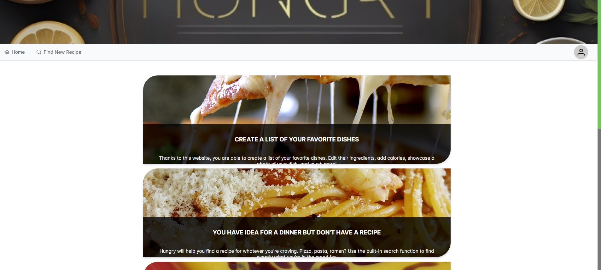
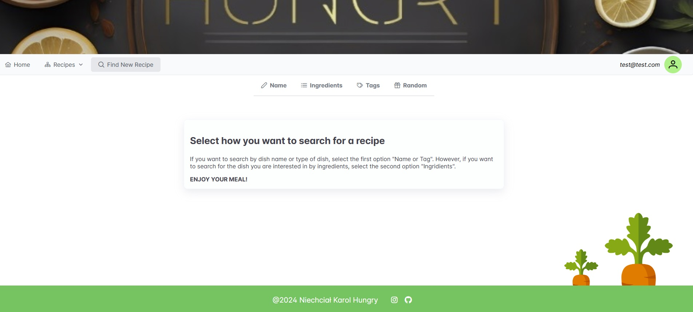
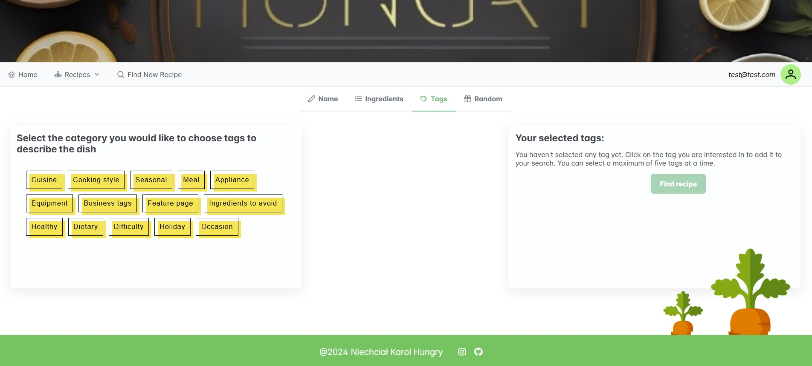
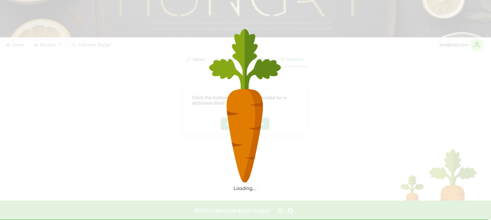
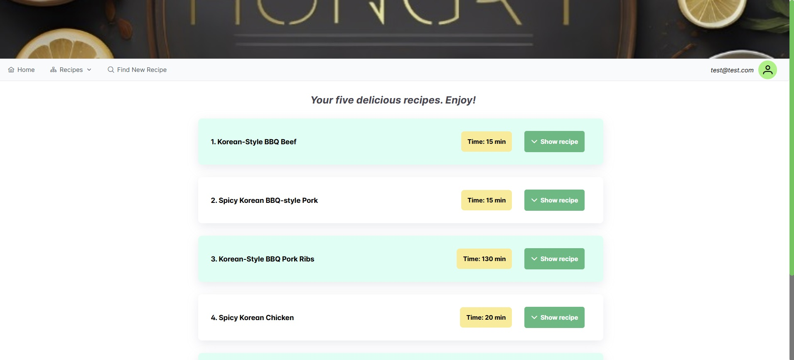
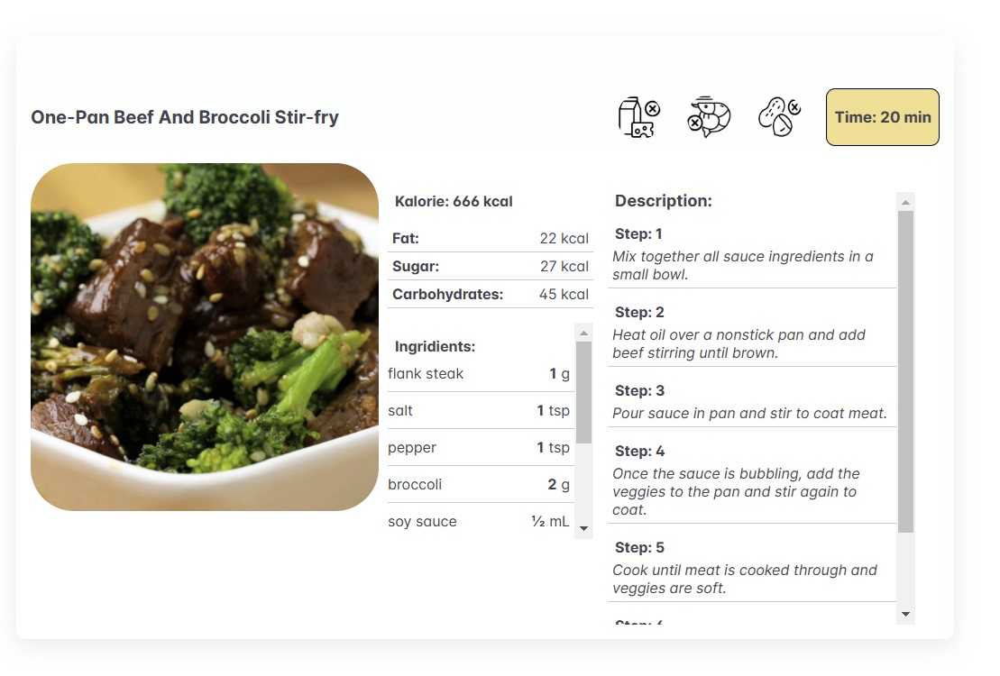
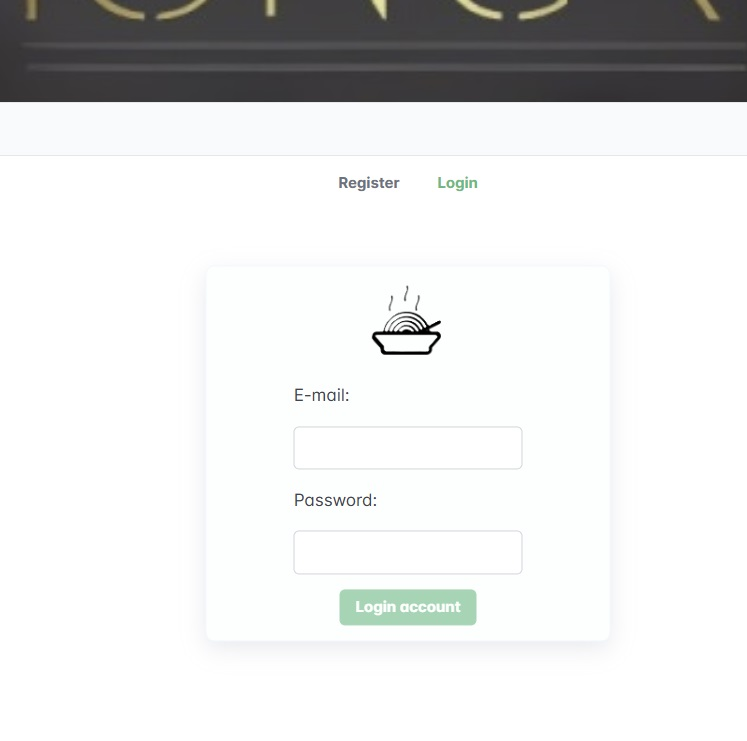

# Hungry 🍲

Hungry is a recipe search and management app that allows users to easily search for recipes by ingredients, name, tags or by randomly selecting any recipe. With Firebase integration, users can register, log in and add their favorite recipes to their own list for quick access.

Link to app: https://hungry-19f55.web.app/

## Tools and technologies 🛠️

The application was created using front-end tools and Firebase to handle authorization and data storage:

- **Frontend**: Vue.js (Composition API), Pinia (state management), PrimeVue (components UI), CSS, HTML
- **Backend i Database**: Firebase (authorization and storage of favorite recipe data)
- **Additional tools**:
  - Figma (interface design)
  - Responsible Web Design (adaptation to mobile and desktop devices)

## Application featuers 📋

- **Recipe Serch**:
  - Search by dish name, ingredients, or tag
  - Random recipe option for culinary inspiration
- **Recipes overview**:
  - After selecting a recipe, its detailed information is displayed (e.g. photo, ingredients, instructions, calories, preparation time).
  - A dedicated loader (animated carrot) informs about loading results.
- **User acount**:
  - Register and log in using Firebase
  - Ability to add recipes to your favorites
  - Manage your favorite recipes (add and remove)

## Application interface 🎨

The app is fully responsive, which means it runs smoothly on mobile devices, tablets, and desktop computers.

### Application View Examples

1. **Home View**  
   

2. **Recipe Finder**  
   

   **E.g. By Tags**  
   

3. **Loader (Animated carrot)**  
   

4. **Recipe Search Results**  
   

5. **Recipe Details**  
   

6. **List of favorite recipes**  
   

7. **Login View**  
   

## Launching the app 🚀

The **Hungry** app is hosted online and available to users without having to run it locally. Simply open the app link in your browser.

## Autorisation 🔒

The login and registration system is powered by Firebase. Users can create an account and log in to add recipes to their favorites and easily manage their cooking resources.

---
